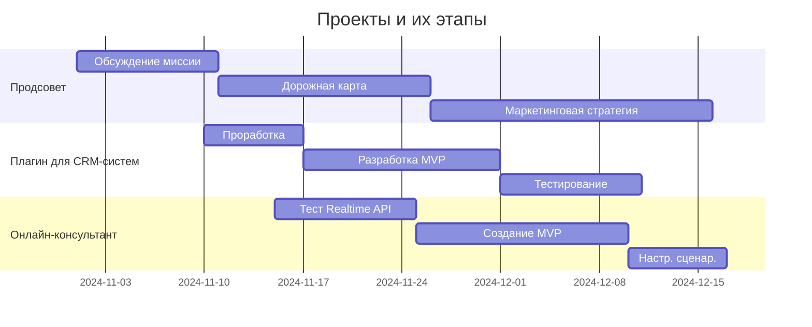
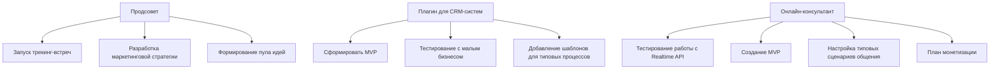
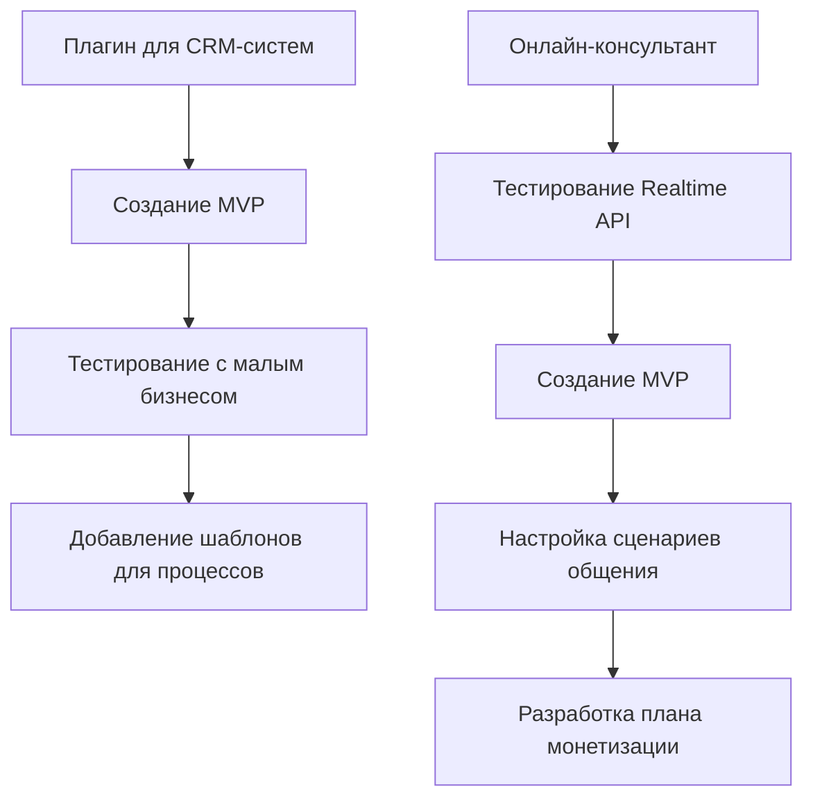
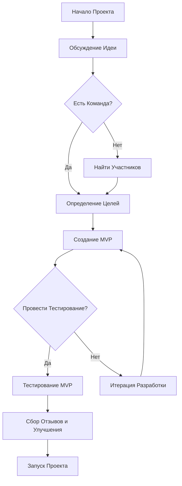
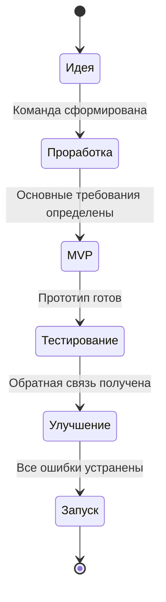

### Таблица  проектов

| Название проекта      | Описание                                                                      | Этап                                                                    | Команда                          | Планы                                                                                                          | Ссылки                                                                          |
| --------------------- | ----------------------------------------------------------------------------- | ----------------------------------------------------------------------- | -------------------------------- | -------------------------------------------------------------------------------------------------------------- | ------------------------------------------------------------------------------- |
| Продсовет             | 1) Ютуб-канал по эффективному использованию технологи и ИИ<br>                | Активное функционирование, разработка новых курсов, развитие сообщества | Дэниал, Игорян                   | Развитие сообщества, создание новых курсов, путь к 100к пдп на ютуб                                            | <br>[Youtube](https://www.youtube.com/channel/UCU-j-8kZJFWTWLPld--ZPcQ)<br><br> |
| Продсовет сообщество  | Сообщество нейроэнтузиастов и ИИ предпринимателей                             |                                                                         |                                  |                                                                                                                | [prodadvice.com](https://prodadvice.com/)                                       |
| Продсовет образование | Образовательная платформа по использованию ИИ                                 |                                                                         |                                  |                                                                                                                |                                                                                 |
| Плагин для CRM-систем | Плагин для автоматизации CRM с помощью ИИ и шаблонов для малого бизнеса.      | Проработка идеи                                                         | ALPHA (Кирилл, Геннадий, Богдан) | - Сформировать MVP <br> - Тестирование с малым бизнесом <br> - Добавить шаблоны для типовых процессов          |                                                                                 |
| Онлайн-консультант    | Инструмент для общения с клиентами в реальном времени на основе Realtime API. | Тестирование Realtime API                                               | ALPHA (Кирилл, Геннадий, Богдан) | - Тестирование работы с Realtime API <br> - Создание MVP <br> - Настройка типовых сценариев <br> - Монетизация |                                                                                 |

---

# Ниже – Плейсхолдеры 🫠

## Mermaid Диаграмма текущих проектов

### 1. Диаграмма Ганта для отображения временной линии проектов



### 2. Иерархическая диаграмма для структурирования команд и задач

Эта диаграмма поможет отобразить, кто участвует в каких проектах, и какие основные задачи есть у команды.



### 3. Диаграмма зависимостей (Dependency Diagram)

Диаграмма зависимостей полезна, когда нужно показать, как различные этапы проектов зависят друг от друга.



### 4. Диаграмма "Flowchart" для отображения процесса работы над проектами

Flowchart можно использовать, чтобы визуализировать процесс работы над проектом, включая принятие решений и ключевые действия.



### 5. Диаграмма состояний для этапов разработки

Диаграмма состояний показывает переходы между различными этапами разработки проектов.



### **1. Продсовет**
- **Описание**: Платформа для объединения участников, обсуждения идей и реализации акселерационных проектов. Основная цель — создать экосистему, поддерживающую инновации и стимулирующую рост сообщества.
- **Этап**: Обсуждение миссии и формулировка дорожной карты.
- **Команда**: Организаторы.
- **Планы**:
  - Запуск трекинг-встреч для определения направлений развития.
  - Разработка маркетинговой стратегии для продвижения платформы и привлечения участников.
  - Формирование пула идей для акселерации и поддержки наиболее перспективных проектов.

---

### **2. Плагин для CRM-систем**
- **Описание**: Плагин, упрощающий настройку CRM при помощи ИИ под задачи малого бизнеса, с использованием шаблонов для автоматизации процессов. Это решение помогает предприятиям сэкономить время на настройке CRM и улучшить управление клиентскими взаимодействиями.
- **Этап**: Проработка идеи, анализ требований и разработка первичного прототипа.
- **Команда**: ALPHA (Кирилл, Геннадий, Богдан).
- **Планы**:
  - Сформировать MVP с базовыми функциями.
  - Провести тестирование с малым бизнесом для получения обратной связи.
  - Добавить шаблоны для автоматизации типовых процессов, таких как управление заявками и контроль сделок.

---

### **3. Онлайн-консультант**
- **Описание**: Инструмент на основе Realtime API для общения с посетителями сайта в реальном времени. Включает сбор контактов и передачу их менеджерам, что позволяет улучшить клиентский опыт и повысить конверсию.
- **Этап**: Проработка идеи, тестирование Realtime API.
- **Команда**: ALPHA (Кирилл, Геннадий, Богдан).
- **Планы**:
  - Провести тестирование работы с Realtime API для оценки стабильности.
  - Сформировать MVP с базовыми функциями, такими как мгновенное общение и сбор контактов.
  - Настроить типовые сценарии общения (например, ответы на часто задаваемые вопросы).
  - Провести тестирование с малым бизнесом для получения реальных отзывов.
  - Разработать планы монетизации: фиксированная плата, подписка, интеграция с другими платформами.

---

## **Новые проекты**

### **Шаблон для добавления нового проекта**
```markdown
- **Название**: [Название проекта].
- **Описание**: [Краткое описание цели и задач проекта].
- **Этап**: [Стадия разработки, например, "Идея", "MVP", "Тестирование"].
- **Команда**: [Имена участников или команда].
- **Планы**:
  - [Конкретный шаг 1].
  - [Конкретный шаг 2].
  - [Конкретный шаг 3].
```
