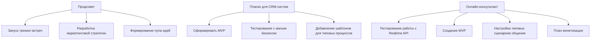

### Таблица текущих проектов

| Название проекта           | Описание                                                                           | Этап                        | Команда                 | Планы                                                                                 |
|----------------------------|------------------------------------------------------------------------------------|-----------------------------|-------------------------|----------------------------------------------------------------------------------------|
| Продсовет                  | Платформа для объединения участников и реализации акселерационных проектов.       | Обсуждение миссии           | Организаторы            | - Запуск трекинг-встреч   - Разработка маркетинговой стратегии   - Формирование пула идей |
| Плагин для CRM-систем      | Плагин для автоматизации CRM с помощью ИИ и шаблонов для малого бизнеса.          | Проработка идеи             | ALPHA (Кирилл, Геннадий, Богдан) | - Сформировать MVP   - Тестирование с малым бизнесом   - Добавить шаблоны для типовых процессов |
| Онлайн-консультант         | Инструмент для общения с клиентами в реальном времени на основе Realtime API.    | Тестирование Realtime API   | ALPHA (Кирилл, Геннадий, Богдан) | - Тестирование работы с Realtime API   - Создание MVP   - Настройка типовых сценариев   - Монетизация |

---

### Mermaid Диаграмма текущих проектов

