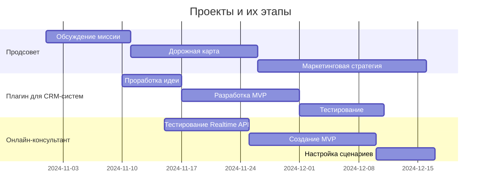

### Таблица текущих проектов

| Название проекта           | Описание                                                                           | Этап                        | Команда                 | Планы                                                                                 |
|----------------------------|------------------------------------------------------------------------------------|-----------------------------|-------------------------|----------------------------------------------------------------------------------------|
| Продсовет                  | Платформа для объединения участников и реализации акселерационных проектов.       | Обсуждение миссии           | Организаторы            | - Запуск трекинг-встреч <br> - Разработка маркетинговой стратегии <br> - Формирование пула идей |
| Плагин для CRM-систем      | Плагин для автоматизации CRM с помощью ИИ и шаблонов для малого бизнеса.          | Проработка идеи             | ALPHA (Кирилл, Геннадий, Богдан) | - Сформировать MVP <br> - Тестирование с малым бизнесом <br> - Добавить шаблоны для типовых процессов |
| Онлайн-консультант         | Инструмент для общения с клиентами в реальном времени на основе Realtime API.    | Тестирование Realtime API   | ALPHA (Кирилл, Геннадий, Богдан) | - Тестирование работы с Realtime API <br> - Создание MVP <br> - Настройка типовых сценариев <br> - Монетизация |

---

### Mermaid Диаграмма текущих проектов


Конечно, ниже я предложу ещё несколько вариантов диаграмм для отображения текущих проектов с помощью Mermaid. Мы можем использовать другие виды диаграмм, такие как диаграмма Ганта, диаграмма потока (Flowchart), иерархическая диаграмма, а также диаграммы для отображения зависимостей. 

### 1. Диаграмма Ганта для отображения временной линии проектов

Диаграмма Ганта отлично подходит для демонстрации временной последовательности задач и этапов для каждого проекта.



### 2. Иерархическая диаграмма для структурирования команд и задач

Эта диаграмма поможет отобразить, кто участвует в каких проектах, и какие основные задачи есть у команды.

```mermaid
graph TB
    A[Проекты]
    A --> B[Продсовет]
    A --> C[Плагин для CRM-систем]
    A --> D[Онлайн-консультант]

    B --> B1[Команда: Организаторы]
    B --> B2[Задача: Запуск трекинг-встреч]
    B --> B3[Задача: Маркетинговая стратегия]

    C --> C1[Команда: ALPHA (Кирилл, Геннадий, Богдан)]
    C --> C2[Задача: MVP]
    C --> C3[Задача: Тестирование с малым бизнесом]

    D --> D1[Команда: ALPHA (Кирилл, Геннадий, Богдан)]
    D --> D2[Задача: Реализация Realtime API]
    D --> D3[Задача: Настройка сценариев]
```

### 3. Диаграмма зависимостей (Dependency Diagram)

Диаграмма зависимостей полезна, когда нужно показать, как различные этапы проектов зависят друг от друга.


### 4. Диаграмма "Flowchart" для отображения процесса работы над проектами

Flowchart можно использовать, чтобы визуализировать процесс работы над проектом, включая принятие решений и ключевые действия.


### 5. Диаграмма состояний для этапов разработки

Диаграмма состояний показывает переходы между различными этапами разработки проектов.


Все эти диаграммы представляют разные аспекты проекта и дают наглядное представление о процессе работы. Если хотите, можем доработать конкретные детали или добавить что-то ещё.